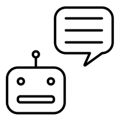
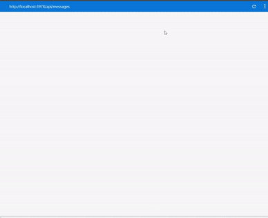

<h1 align = "center">
 
  
 
 
chatBot Pizzaria
</h1>

 chatBot para atendimento de uma pizzaria 

  

[//]: # (adicione seus gifs / imagens aqui :)

  
  

## Recursos
[//]: # (adicione os recursos do seu projeto aqui :)
Esse chat bot foi construido utilizando ferramentas da microsoft

- **Microsoft bot framework v4.**
- node
- azure
- Luis.ai
- botbuilder@3.14
- restify@6.3.4 - > como se fosse um nodemon
- dot-env-extended 
- moment- data e hora

## Começando
1. abra o terminal e digite `git clone https://github.com/PyDecco/chatbot-pizzaria`
2. Direcione até o terminal com o comando `cd chatbot-pizzaria`
2. Realize o comando `yarn`
3. digite `vscode .`
3. instale o node-gyp de forma global
4. Realize um cadastro no site LUIS: https://www.luis.ai/
5. Faça o cadastro no site azure https://azure.microsoft.com/pt-br/services/bot-service/

## Licença

Este projeto está licenciado sob a licença MIT - consulte a página [LICENSE] (https://opensource.org/licenses/MIT) para obter detalhes.

